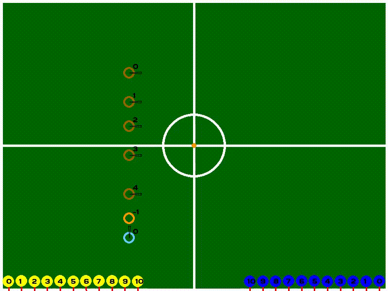

# SSL Hardware Challenge Tool

This tool will check if the robots/ball are correctly placed for the given
challenge.

It will wait until all robots/ball are placed, wait 2 seconds and ask the user
to confirm the beginning of the challenge. After that, everything will happen
automatically.

## Dependencies

- Python 3.8.5
  - [WebSocket](https://pypi.org/project/websocket-client/)
  - Pygame
  - Numpy
  - Protobuf

**PS**: Only tested in Ubuntu 20.04.

To install the Python packages run

```shell
pip3 install websocket-client pygame tabulate numpy protobuf
```

The project already contains de compiled .proto files for Python, but, in case
you need to re-compile/update them you need to place the new .proto files in
the `proto` folder and then use the included script:

```shell
./update_protos.sh
```

## Usage

Before starting any challenge make sure that all the following conditions are
met:

- Both GameController and AutoRef (Preferably TIGERs) must be used
- The tool must run in the same computer as the GC
- The GC must be set to accept all proposals
- The AutoRef must be set to *active*
- The game state must be either First Half or Second Half
- Make sure the goal positions for each team are configured correctly in the GC

At last, run the `ChallengeManager.py` with:

```shell
python3 src/ChallengeManager.py -f <challenge_positions.json> -c <challenge_number>
```

- **challenge_positions.json**: is the .json file that contains the positions
  of the challenge.
- **challenge_number**: is the **id** of the challenge, must be between 1 and 5.

**NOTE**: Challenge N⁰ 5 is the Technical Challenge - Ball Placement.

**NOTE**: In case there is too much noise in your camera setup, you can enable
TIGERs AutoRef detection by passing the argument **-A 1**.

Example:

```shell
python3 src/ChallengeManager.py -f src/json_examples/challenge_1.json -c 1
```

For more information about the input arguments use:

```shell
python3 src/ChallengeManager.py -h
```

### User Interface

The graphical user interface shows:

- The position of each yellow robot: dark yellow circle
- The position of each blue robot:  light blue circle
- The position of the ball: orange circle

The colored circles indicate a threshold distance where the object must be
placed, currently this threshold is **20mm** and **5⁰**. Therefore, the object
must be within a distance of **20mm** from the challenge position, with less
than **5⁰** of orientation error. (subject to change)

If the object (robot/ball) is correctly placed, it's corresponding circle will
turn light green, as shown in the image below.



**NOTE**: If the robot drawing is too big, it is probably because the tool hasn't
received a geometry packet yet.

### Warnings

The tool will warn the user if there is any infliction of the rules of the challenge
regarding the initial position, the warnings indicate:

- If there are more defending robots (yellow) than the number defined in the
  json
- If there are more attacking robots (blue) than the number allowed for the
  current challenge
  - The 'Found' and 'Max' values in this warning mean, how many extra robots
    are in the field, and how many extra robots are allowed, respectively. A
    robot with its position defined in the json doesn't count

- If the robots that do not have their position defined in the json are in a
  valid position (usually the middle line)
